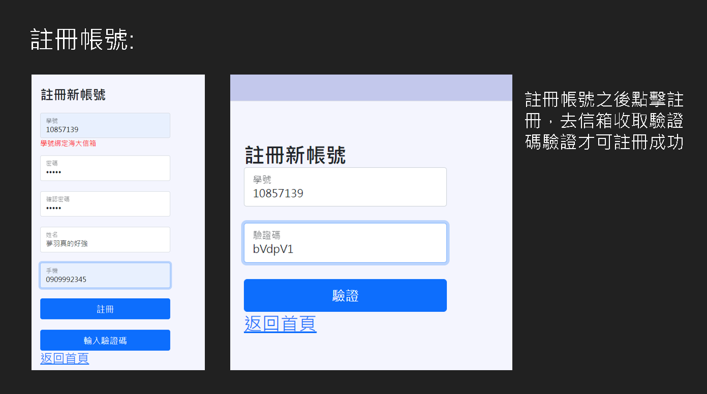
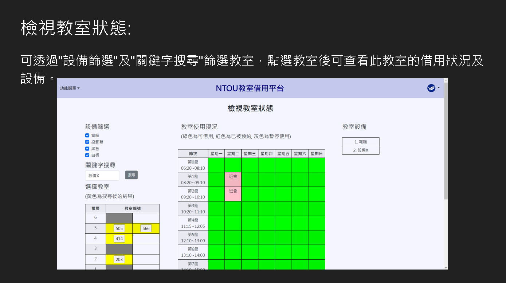

# NTOU_classLender

A platform that allow the people check the classroom's status and lend classroom.

一個經過非常嚴謹的軟體開發流程製作出來的教室借用平台，包含SDD、STD、PRD等文件串寫、github版控、Trello分工和進度控制等。
不過很遺憾的，該系統由於安全考量，只限使用NTOU學校信箱註冊，對於校外人士可能無法隨意登入觀看。

Demo video: https://www.youtube.com/watch?v=n2gb6Lq_vJQ

Demo URL : https://sungod3.github.io/NTOU_classroomLender/frontend/index.html

## Flow Chart

## System Architecture

Internal Architecture:

## Preview

